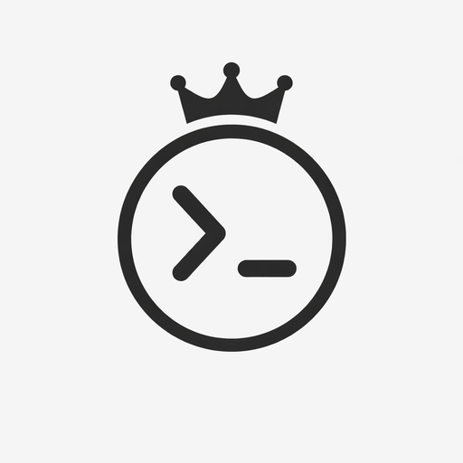

<p align="center">
  
</p>

<h1 align="center">Codex Desktop</h1>

<p align="center">
  <strong>Protocol-native Codex GUI: faster, safer, and more reliable than terminal wrappers.</strong><br>
  <strong>协议原生的 Codex 图形界面：比终端包装器更快、更安全、更可靠。</strong>
</p>

<p align="center">
  <a href="https://opensource.org/licenses/MIT">
    
  </a>
  <a href="https://react.dev/">
    
  </a>
  <a href="https://www.typescriptlang.org/">
    
  </a>
  <a href="https://tauri.app/">
    
  </a>
  <a href="https://vite.dev/">
    
  </a>
</p>

<p align="center">
  <a href="#english">English</a> | <a href="#中文">中文</a>
</p>

---

<a name="english"></a>

# English

## Why Protocol-Native?

Most Codex GUIs are **terminal wrappers** — they spawn a CLI process and parse stdout/stderr. This approach is fragile, slow, and unsafe:

| Terminal Wrapper | Protocol-Native (This Project) |
|------------------|-------------------------------|
| Parse CLI output text | Direct JSON-RPC communication |
| No approval control | Full approval request/response loop |
| Memory leaks on timeout | Automatic pending request cleanup |
| Single session only | Multi-agent concurrent sessions |

**Codex Desktop** communicates directly with the Codex server via JSON-RPC protocol, giving you:

- **Speed** — No CLI parsing overhead, instant response streaming
- **Safety** — Structured approval flow, every file change requires explicit consent
- **Reliability** — Proper timeout handling, no zombie processes or memory leaks

## Architecture Evidence

### 1. JSON-RPC Server Management

```
src-tauri/src/server/
├── mod.rs              # Server lifecycle management
├── process.rs          # JSON-RPC process communication
└── protocol.rs         # Wire protocol implementation
```

Direct protocol communication instead of CLI stdout parsing. Server state is managed at the application level, not scraped from terminal output.

### 2. Approval Request/Response Loop

```
src/stores/thread/
├── approval.ts         # Approval state machine
├── pending-requests.ts # Request queue management
└── actions.ts          # approve() / reject() handlers
```

Every file modification and shell command goes through a structured approval flow:
- Server sends `approval_request` via JSON-RPC
- GUI presents diff view with Accept/Reject buttons
- User decision sent back as `approval_response`
- **No action executes without explicit user consent**

### 3. Pending Request Cleanup & Timeout Protection

```typescript
// Thread store automatically cleans up on:
// - Session close
// - Thread switch
// - Application exit
// - Request timeout (configurable)

cleanupPendingRequests(threadId: string): void
clearAllPendingRequests(): void
```

Terminal wrappers leave orphaned processes. Protocol-native cleanup ensures:
- No memory leaks from abandoned requests
- No zombie Codex processes
- Graceful timeout handling without data loss

## Features

### Core Capabilities

- **Multi-Agent Sessions** — Run multiple Codex agent threads simultaneously, each with independent context
- **Project-Centric Workflow** — Organize sessions by project, with Git integration
- **Real-time Streaming** — Watch AI responses stream via efficient delta buffering
- **Approval System** — Review file changes and commands before execution

### Advanced Features

- **Undo/Redo** — Up to 20 checkpoint rollbacks per session
- **Slash Commands** — `/help`, `/status`, `/clear`, etc.
- **Local Persistence** — SQLite storage, no cloud dependency
- **Theme Support** — Light/dark modes
- **Keyboard Shortcuts** — Power-user navigation

### Performance

- **LRU Cache** — Max 500 active threads with automatic eviction
- **Virtual Scrolling** — Smooth scrolling for long conversations
- **Code Splitting** — Lazy-loaded components for fast startup

## Installation

### Prerequisites

| Requirement | Version | Notes |
|-------------|---------|-------|
| Node.js | >= 22.0 | LTS recommended |
| npm / pnpm | Latest | Package manager |
| Rust | Edition 2021 | For Tauri development |
| Codex CLI | Latest | Backend server |

### Quick Start

```bash
# Clone the repository
git clone https://github.com/Colinchen-333/codex-GUI.git
cd codex-GUI

# Install dependencies
npm install

# Start development (web only)
npm run dev

# Start with Tauri (full desktop app)
npm run tauri:dev
```

### Platform Setup

<details>
<summary><strong>macOS</strong></summary>

```bash
xcode-select --install
curl --proto '=https' --tlsv1.2 -sSf https://sh.rustup.rs | sh
```
</details>

<details>
<summary><strong>Windows</strong></summary>

1. Install [Visual Studio Build Tools](https://visualstudio.microsoft.com/visual-cpp-build-tools/)
2. Install [Rust](https://www.rust-lang.org/tools/install)
</details>

<details>
<summary><strong>Linux (Ubuntu/Debian)</strong></summary>

```bash
sudo apt update
sudo apt install libwebkit2gtk-4.1-dev build-essential curl wget libssl-dev libgtk-3-dev librsvg2-dev
curl --proto '=https' --tlsv1.2 -sSf https://sh.rustup.rs | sh
```
</details>

## Development

### Scripts

| Script | Description |
|--------|-------------|
| `npm run dev` | Start Vite dev server |
| `npm run build` | Build for production |
| `npm run tauri:dev` | Start Tauri dev mode |
| `npm run tauri:build` | Build desktop app |
| `npm run test:unit` | Run unit tests |
| `npm run test` | Run E2E tests |
| `npm run lint` | Check code style |

### Project Structure

```
codex-GUI/
├── src/                      # Frontend (React + TypeScript)
│   ├── components/           # UI components
│   ├── stores/               # Zustand state (thread, approval, sessions)
│   ├── lib/                  # Utilities + API client
│   └── hooks/                # Custom React hooks
├── src-tauri/                # Backend (Rust)
│   ├── src/server/           # JSON-RPC server management
│   ├── src/commands/         # IPC command handlers
│   └── src/database/         # SQLite operations
└── e2e/                      # End-to-end tests
```

## Security

- **Approval System** — Every file change requires explicit user consent
- **Local Storage** — All data stays on your machine (SQLite)
- **Type Safety** — Strict TypeScript prevents runtime errors
- **No Telemetry** — No data sent without user action

## License

MIT License — see [LICENSE](LICENSE) for details.

---

<a name="中文"></a>

# 中文

## 为什么选择协议原生？

大多数 Codex GUI 都是**终端包装器**——它们启动一个 CLI 进程并解析 stdout/stderr。这种方式脆弱、缓慢且不安全：

| 终端包装器 | 协议原生（本项目） |
|-----------|-------------------|
| 解析 CLI 输出文本 | 直接 JSON-RPC 通信 |
| 无审批控制 | 完整的审批请求/响应闭环 |
| 超时时内存泄漏 | 自动清理待处理请求 |
| 仅支持单会话 | 多智能体并发会话 |

**Codex Desktop** 通过 JSON-RPC 协议直接与 Codex 服务器通信，为你提供：

- **速度** — 无 CLI 解析开销，即时响应流
- **安全** — 结构化审批流程，每次文件变更都需要明确同意
- **可靠** — 正确的超时处理，无僵尸进程或内存泄漏

## 架构证据

### 1. JSON-RPC 服务器管理

```
src-tauri/src/server/
├── mod.rs              # 服务器生命周期管理
├── process.rs          # JSON-RPC 进程通信
└── protocol.rs         # 传输协议实现
```

直接协议通信，而非解析 CLI stdout。服务器状态在应用层管理，不是从终端输出中抓取。

### 2. 审批请求/响应闭环

```
src/stores/thread/
├── approval.ts         # 审批状态机
├── pending-requests.ts # 请求队列管理
└── actions.ts          # approve() / reject() 处理器
```

每个文件修改和 Shell 命令都经过结构化审批流程：
- 服务器通过 JSON-RPC 发送 `approval_request`
- GUI 展示差异视图和接受/拒绝按钮
- 用户决策作为 `approval_response` 发回
- **未经用户明确同意，任何操作都不会执行**

### 3. 待处理请求清理与超时保护

```typescript
// Thread store 自动清理：
// - 会话关闭时
// - 线程切换时
// - 应用退出时
// - 请求超时时（可配置）

cleanupPendingRequests(threadId: string): void
clearAllPendingRequests(): void
```

终端包装器会留下孤儿进程。协议原生清理确保：
- 无因废弃请求导致的内存泄漏
- 无僵尸 Codex 进程
- 优雅的超时处理，无数据丢失

## 功能特性

### 核心功能

- **多智能体会话** — 同时运行多个 Codex 智能体线程，各自独立上下文
- **项目中心化工作流** — 按项目组织会话，集成 Git
- **实时流式响应** — 通过高效增量缓冲观看 AI 响应
- **审批系统** — 执行前审查文件变更和命令

### 高级特性

- **撤销/重做** — 每个会话最多 20 个检查点回滚
- **斜杠命令** — `/help`、`/status`、`/clear` 等
- **本地持久化** — SQLite 存储，无需云服务
- **主题支持** — 亮色/暗色模式
- **键盘快捷键** — 高效导航

### 性能优化

- **LRU 缓存** — 最多 500 个活动线程，自动淘汰
- **虚拟滚动** — 长对话流畅滚动
- **代码分割** — 懒加载组件，快速启动

## 安装

### 环境要求

| 要求 | 版本 | 说明 |
|------|------|------|
| Node.js | >= 22.0 | 推荐 LTS 版本 |
| npm / pnpm | 最新 | 包管理器 |
| Rust | Edition 2021 | 用于 Tauri 开发 |
| Codex CLI | 最新 | 后端服务器 |

### 快速开始

```bash
# 克隆仓库
git clone https://github.com/Colinchen-333/codex-GUI.git
cd codex-GUI

# 安装依赖
npm install

# 启动开发（仅 Web）
npm run dev

# 启动 Tauri（完整桌面应用）
npm run tauri:dev
```

### 平台设置

<details>
<summary><strong>macOS</strong></summary>

```bash
xcode-select --install
curl --proto '=https' --tlsv1.2 -sSf https://sh.rustup.rs | sh
```
</details>

<details>
<summary><strong>Windows</strong></summary>

1. 安装 [Visual Studio Build Tools](https://visualstudio.microsoft.com/visual-cpp-build-tools/)
2. 安装 [Rust](https://www.rust-lang.org/tools/install)
</details>

<details>
<summary><strong>Linux (Ubuntu/Debian)</strong></summary>

```bash
sudo apt update
sudo apt install libwebkit2gtk-4.1-dev build-essential curl wget libssl-dev libgtk-3-dev librsvg2-dev
curl --proto '=https' --tlsv1.2 -sSf https://sh.rustup.rs | sh
```
</details>

## 开发

### 脚本命令

| 脚本 | 说明 |
|------|------|
| `npm run dev` | 启动 Vite 开发服务器 |
| `npm run build` | 生产环境构建 |
| `npm run tauri:dev` | 启动 Tauri 开发模式 |
| `npm run tauri:build` | 构建桌面应用 |
| `npm run test:unit` | 运行单元测试 |
| `npm run test` | 运行 E2E 测试 |
| `npm run lint` | 检查代码风格 |

### 项目结构

```
codex-GUI/
├── src/                      # 前端 (React + TypeScript)
│   ├── components/           # UI 组件
│   ├── stores/               # Zustand 状态 (thread, approval, sessions)
│   ├── lib/                  # 工具库 + API 客户端
│   └── hooks/                # 自定义 React Hooks
├── src-tauri/                # 后端 (Rust)
│   ├── src/server/           # JSON-RPC 服务器管理
│   ├── src/commands/         # IPC 命令处理器
│   └── src/database/         # SQLite 操作
└── e2e/                      # 端到端测试
```

## 安全性

- **审批系统** — 每次文件变更都需要明确的用户同意
- **本地存储** — 所有数据保存在本地（SQLite）
- **类型安全** — 严格的 TypeScript 防止运行时错误
- **无遥测** — 未经用户操作不发送任何数据

## 许可证

MIT 许可证 — 详见 [LICENSE](LICENSE)。

---

<p align="center">
  Made by <a href="https://github.com/Colinchen-333">Colin Chen</a> / Lumirain Studio
</p>

<p align="center">
  <a href="https://github.com/Colinchen-333/codex-GUI/issues">Report Bug / 报告问题</a> |
  <a href="https://github.com/Colinchen-333/codex-GUI/issues">Request Feature / 功能请求</a>
</p>
